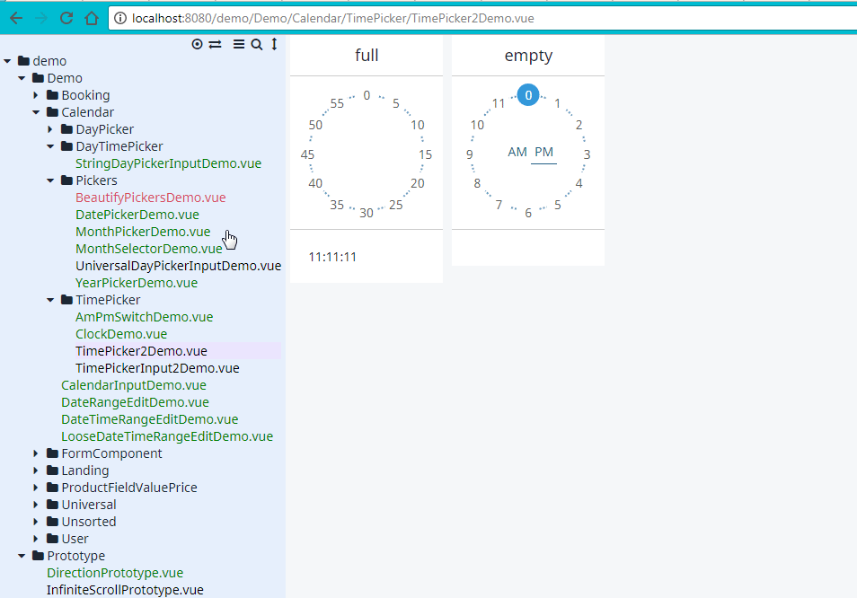

[![Build status][circleci-badge]][circleci-url]

# vue-component-tree

Tree view for your demo components. [Demo](http://vue-component-tree-demo.asva.by/#/Demo/ContactComponent.vue).



## Install

* **npm**: `npm install -D vue-component-tree` 
* **yarn**: `yarn add -D vue-component-tree`

## Features
* Display your components as a tree or flat list.
* Preview components on the page.
* Text search (keybind: press Shift then Shift)
* Routing support.
* Shows dependencies for you components.
* Saves on page reload.
* Colored statuses.

## The gist

I'll talk a bit about demo based workflow I employ in my projects.

Before doing any work on component I create a demo. Demo allows me to define an interface, like this:
```html
<vm-new-component v-model="dataItem" :some-prop="prop"/>
```
Only then I start to work on component.

You can think of demo as of semi-manual unit tests. But why not use actual unit tests, you'll ask. Let me explain.
* Demos are cheap. And you don't have to be a senior unit tester to create them.
* Demos are visual. In many cases you can *see* if something goes wrong. But unit tests won't show any of your styling mistakes.
* Demos are developer friendly. You can instantly find usage examples or just glance over existing components. Which is crucial for teamwork.

Of course, this doesn't mean you have to dump unit tests. Leave them for appropriate tasks. Like logic heavy classes.

So, back to the library. The main intent behind is simplifying demo workflow as much as possible. Just toss your demos into folder and enjoy tree generation.

## Config

Attach VueComponentTree to your router. And yes, [vue-router](https://github.com/vuejs/vue-router) is required.
```
import Router from 'vue-router'
import VueComponentTree from 'vue-component-tree'

const router = new Router({
  routes: [
    VueComponentTree(require.context('./../tree', true, /.vue$/), '/demo'),
  ]
})
```
So, about arguments. 

`require.context('./../tree', true, /.vue$/), '/demo'`
* `./../tree` is path to your demo folder. Works the same as require/import.
* `/demo` is root route for vue-router.

### Production

You don't have to keep demos in production. Use webpack [define-plugin](https://webpack.js.org/plugins/define-plugin/) and exclude them from bundle.

### Deploy

 * `yarn demo` - compile assets
 * `yarn dist` - compile assets
 * `npm publish` - publish to npm

## Feedback | Support
Leave an issue if something doesn't work for you.

Also remember: Stars fuel package development! 

## Licence
MIT

[circleci-badge]: https://img.shields.io/circleci/project/github/asvae/vue-component-tree/master.svg?style=flat-square
[circleci-url]: https://circleci.com/gh/asvae/vue-component-tree
