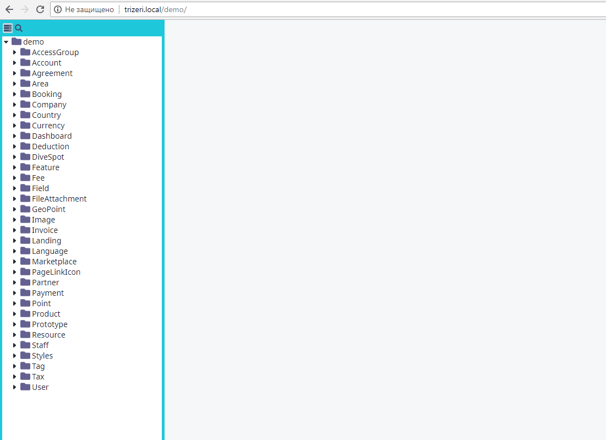

# vue-book

Tree view for your demo components. [Demo](http://vue-book.asva.by/#/Demo/ContactComponent.vue).



## Install

* **npm**: `npm install -D vue-book` 
* **yarn**: `yarn add -D vue-book`

## Features
* Display your components as a tree or flat list.
* Preview components on the page.
* Text search.
* Routing support.
* Saves on page reload.

## The gist

I'll talk a bit about demo based workflow I employ in my projects.

Before doing any work on component I create a demo. Demo allows me to define an interface, like this:
```html
<my-new-component v-model="dataItem" :some-prop="prop"/>
```
Only then I start to work on component.

You can think of demo as of semi-manual unit tests. But why not use actual unit tests, you'll ask. Let me explain.
* Demos are cheap. And you don't have to be a senior unit tester to create them.
* Demos are visual. In many cases you can *see* if something goes wrong. But unit tests won't show any of your styling mistakes.
* Demos are developer friendly. You can instantly find usage examples or just glance over existing components. Which is crucial for teamwork.

Of course, this doesn't mean that you have to dump unit tests. Just keep them for appropriate tasks. Like logic heavy classes.

So, back to the library. The main intent behind is simplifying demo workflow as much as possible. Just toss your demos into folder and enjoy tree generation.

## Config

Attach VueComponentTree to your router. And yes, [vue-router](https://github.com/vuejs/vue-router) is required.
```js
import Router from 'vue-router'
import { createRoute } from 'vue-book'

const router = new Router({
  routes: [
    createRoute({
      requireContext: require.context('./..', true, /.demo.vue$/), 
      path: '/demo',
      hideFileExtensions: true, // optional, hides file extensions in list.
      hideNavigation: true, // optional, hides navigation panel. Intended to be used with visual recognition library.
    }),
  ]
})
```
So, about arguments. 

`require.context('./../tree', true, /.vue$/), '/demo'`
* `./../tree` is path to your demo folder. Works the same as require/import.
* `/demo` is root route for vue-router.

Here's the vue-cli3 [demo project](https://github.com/asvae/vue-book-demo) if something doesn't work for you.

### Production

You don't have to keep demos in production. Use webpack [define-plugin](https://webpack.js.org/plugins/define-plugin/) and exclude them from bundle.

```javascript
if (process.env.NODE_ENV !== 'production') {
  const createRoute = require('vue-book').createRoute
  
  routes.push([
    createRoute({
      requireContext: require.context('./..', true, /.demo.vue$/), 
      path: '/demo',
    }),
  ])
}
```

### Deploy

 * `yarn serve` - run dev server;
 * `yarn demo` - compile assets;
 * `yarn dist` - compile assets;
 * `npm publish` - publish to npm.
 
 
### Use as component

You can use `vue-book` without router if you don't need it.

```javascript
const getComponent = require('vue-book').getComponent

const DemoView = getComponent({
  requireContext: require.context('./..', true, /.demo.vue$/),
})
````

You can handle resulting `DemoView` the same as any other vue component.

## Feedback | Support
Leave an issue if something doesn't work for you.

Also remember: Stars fuel package development! 

## Hooks
In component you can use [`beforeRouteUpdate`](https://router.vuejs.org/guide/advanced/navigation-guards.html#in-component-guards). Common case is to reset some global service.

## Helper components [WIP]

Vue book provides a bunch of helper components to simplify demo-building.

### VbDemo

Root level container.

### VbCard

You can consider this component as both 'card' and 'test-case'.

**Props**

* `title` - String. Title of the card.
* `noPadding` - Boolean. Removes padding of `VbCard` content
* `dashed` - Boolean. Makes card border dashed, which makes it easier to see in some cases.
* `refresh` - Boolean. Shows on card header a refresh button that redraws card content. Useful for testing reactivity.
* `width` - String. Card width.
* `height` - String. Card height.
* `color` - String. Card color.
* `dark` - Boolean. Dark color theme.
 
* `focus` - Boolean. If any `VbCard` is focused - only focused cards will be shown in demo. This is useful when you want to work on specific case and hide unneeded ones. 

### Install

```js
import { VueBookComponents } from '../src/app'

Vue.use(VueBookComponents)
```

Component helpers

```vue
<VbDemo>
  <VbCard title="is active">
    <YourComponent is-active/>
  </VbCard>
</VbDemo>
```

Functional helpers:

```vue
<button @click="$vb.log('log', 'value')">Trigger log</button>
<button @click="$vb.alert('alert')">Trigger alert</button>
<div>Lorem text: {{ $vb.lorem() }}</div> 
<div>Lorem text of length: {{ $vb.lorem(5) }}</div>
```

## Licence
MIT

[circleci-badge]: https://img.shields.io/circleci/project/github/asvae/vue-book/master.svg?style=flat-square
[circleci-url]: https://circleci.com/gh/asvae/vue-book 
